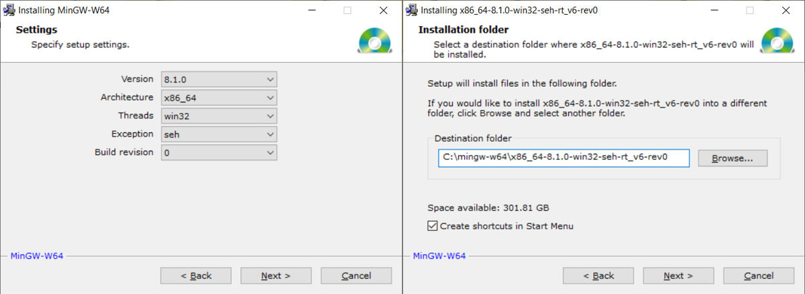
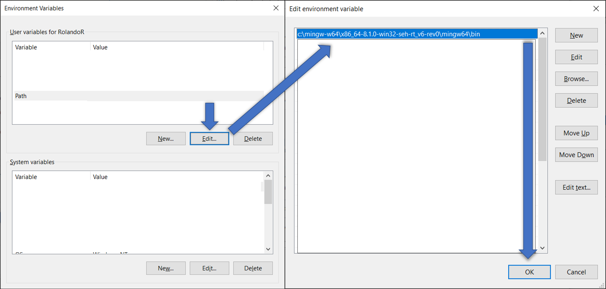
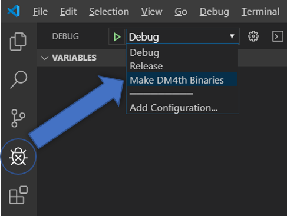
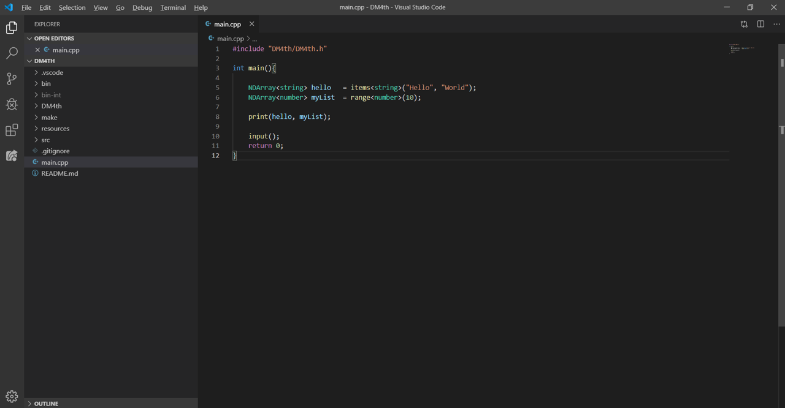
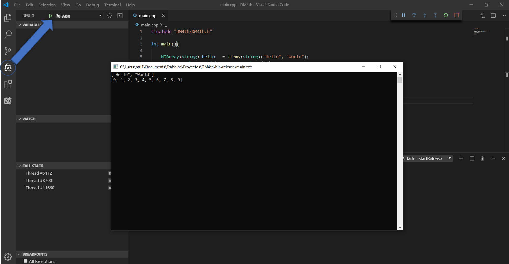

# Instalación de DM4th
## Prerrequisitos:

1. Tener instalado un IDE de desarrollo para `C++` o un editor de texto como [Visual Studio Code](https://code.visualstudio.com/).
    - Si utilizas Visual Studio Code, instalar la [extensión de C++](https://marketplace.visualstudio.com/items?itemName=ms-vscode.cpptools) 
2. Tener instalado un compilador de C++ en tu PC (`Mingw-w64` recomendado para Windows)
   Si ya lo tienes instalado, saltar a la sección de [Incluyendo DM4th](#Incluyendo-DM4th)
    -   Descarga el compilador desde el siguiente [enlace](http://mingw-w64.org/doku.php/download/mingw-builds). **Es importante que la ruta de instalación no contenga espacios** (en otras palabras evitar rutas como `C:/Program Files/`), se recomienda instalar el compilador en `C:/Mingw-w64`
  
        
    - Es necesario incluir en el `PATH` la ruta donde están los archivos binarios del compilador:
        - Incluir en el `PATH` de las variables de entorno de windows la siguiente ruta: `c:\mingw-w64\x86_64-8.1.0-win32-seh-rt_v6-rev0\mingw64\bin"`. Si has instalado el compilador en una ruta distinta, debes hacer los cambios correspondientes correspondiente. 
        
        **NOTA:** Dentro de esta ruta deben encontrarse los ejecutables `g++.exe` y `gdb.exe`

        <!-- 
         -->
        - **Reinicia tu PC**. Puedes comprobar que el compilador está instalado ejecutando desde el Command prompt el siguiente comando: `g++ --version`

# Incluyendo DM4th

1. Clona DM4th en tu PC o descarga el `.zip` del proyecto
2. Abre la carpeta DM4th desde el Visual Studio Code
    - **NOTA:** Sólo para la primera vez que descargues o clones `DM4th` en un nuevo directorio, debes generar los archivos binarios. si utilizas Visual Studio Code, ejecuta la tarea `Make DM4th Binaries`; si usas otro editor, puedees generar los binarios desde *make/makeDM4thProject.bat* 
    
3. Abre el archivo `main.cpp`, haz alguna modificación si deseas y luego ejecútalo haciendo clic en `Release`.

