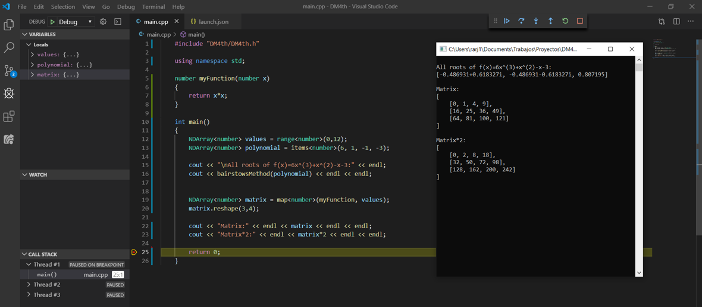

# DM4th
DM4th es una librería escrita en `C++` que prevee numerosos métodos y clases que permitirán un fácil manejo de operaciones con vectores, matrices, árboles y números complejos. 



## Características
- Clase tipo `NDArray` que permitirán manejar vectores y matrices multidimensionales de manera dinámica.
  - Métodos de push, pop, resize y reshape incluídos.
  - Sobrecarga de operadores aritméticos y binarios.
  - Sistema de conteo de referencias por array que permitirán administrar memoria sin pensar en punteros por parte del programador .
- Clase tipo `Tree` con métodos para manejo de estructuras no lineales de forma sencilla.
  - Árboles binarios y árboles N-arios soportados.
  - Métodos de push, pop y resize de hijos.
  - Sistema de conteo de referencias por cada hijo de un árbol que permitirán administrar memoria sin pensar en punteros por parte del programador.
- Métodos numéricos de utilidad para diferentes operaciones de cálculo diferencial e integral, álgebra lineal, entre otros.
  - Soluciones de métodos de búsqueda de raíces de función como Newthon-Raphson y el Método de Bairstow con soporte de raíces complejas.
  - Soporte de resultados con números reales y complejos en todos los métodos incluídos en la librería.
- Entrada y salida por consola utilizando métodos input() y print() de números complejos, arreglos multidimensionales y árboles.

## Instalación y compilación
* DM4th es un `header-only library`. No es necesario compilar dependencias para instalar. Basta con descargar o clonar la librería dentro de tu proyecto e incluir la cabecera `#include "DM4th/DM4th.h"`.

    Si no tienes ningún entorno de desarrollo instalado, puedes puedes instalar un editor de código y compilador de C++ recomendado:
    
   *  [Instalar compilador de C++ y editor de código en Windows](https://code.visualstudio.com/docs/cpp/config-mingw).


  **NOTA:** DM4th es compatible con versiones de C++11 en adelante.

* Si usas g++, la siguiente instrucción de compilación con `DM4th` puede ser suficiente:

    ```sh
    g++ -std=c++11 main.cpp
    ```
    Para un mejor rendimiento, puedes activar el procesamiento multihilo incluído dentro de la librería agregando las banderas `-fopenmp` y `-D DM4thParallel`
    ```sh
    g++ -std=c++11 main.cpp -fopenmp -D DM4thParallel
    ```

## Ejemplos
 
* Impresión en consola de arreglos de diferentes tipos
    ```C#
    #include "DM4th/DM4th.h"

    int main()
    {
        NDArray<string> hello  = items<string>("Hello", "World");
        NDArray<number> myList = range<number>(10);

        print(hello, myList);

        input();
        return 0;
    }
    ```
    ```C++
    SALIDA:

    ["Hello", "World"]
    [0, 1, 2, 3, 4, 5, 6, 7, 8, 9]
    ```
* Operaciones básicas con números complejos
 
    ```C#
    #include "DM4th/DM4th.h"

    int main()
    {
        number a = 5+7i;
        number b = 10-2i;
        number c = -25;

        print("sum:", a+b);
        print("sub:", a-b);
        print("mult:", a*b);
        print("div:", a/b);
        print("sqrt:", sqrt(c));
        print("sin:", sin(rad(c)));
        input();
        
        return 0;
    }
    ```
    ```json
    SALIDA:

    sum:
    15+5i

    sub:
    -5+9i

    mult:
    64+60i

    div:
    0.34615+0.76923i

    sqrt:
    5i

    sin:
    -0.42262
    ```

* Operaciones con arreglos
    ```C#
    #include "DM4th/DM4th.h"

    int main()
    {
        NDArray<number> arr1 = range<number>(5);
        NDArray<number> arr2 = range<number>(10,5,-1);
        number value = 10;

        print("arr1:",arr1);
        print("arr2:",arr2);
        
        print("sum", arr1+arr2);
        print("sub", arr1-arr2);
        print("mult", arr1*arr2);
        print("div", arr1/value);

        input();
        return 0;
    }
    ```
    ```json
    SALIDA:

    arr1:
    [0, 1, 2, 3, 4]

    arr2:
    [10, 9, 8, 7, 6]

    sum
    [10, 10, 10, 10, 10]

    sub
    [-10, -8, -6, -4, -2]

    mult
    [70]

    div
    [0, 0.1, 0.2, 0.3, 0.4]

    ```

* Inserción y eliminación de elementos en arreglos de una dimensión
    ```C#
    #include "DM4th/DM4th.h"

    int main()
    {
        NDArray<number> arr1 = items<number>(1,3,5,7,9);
        NDArray<number> arr2 = items<number>(2,4,6,8,0);
        number value = 1000;

        print("arr1:",arr1);
        print("arr2:",arr2);

        arr1.push(value);
        print("value "+string(value)+" inserted:",arr1);

        arr1.pushArray(arr2);
        print(arr1);

        arr1.push(-999, 3);
        print("Insert value into array at index 3:",arr1);

        print("Remove elements from array:");
        arr1.pop();
        print(arr1);

        arr1.pop(0);
        print(arr1);

        input();
        return 0;
    }
    ```
    ```c++
    SALIDA: 

    arr1:
    [1, 3, 5, 7, 9]

    arr2:
    [2, 4, 6, 8, 0]

    value 1000 inserted:
    [1, 3, 5, 7, 9, 1000]

    [1, 3, 5, 7, 9, 1000, 2, 4, 6, 8, 0]

    Insert value into array at index 3:
    [1, 3, 5, -999, 7, 9, 1000, 2, 4, 6, 8, 0]

    Remove elements from array:

    [1, 3, 5, -999, 7, 9, 1000, 2, 4, 6, 8]

    [3, 5, -999, 7, 9, 1000, 2, 4, 6, 8]
    ```

* Operaciones con arreglos de 2 dimensiones
    ```C#
    #include "DM4th/DM4th.h"

    int main()
    {
        NDArray<number> arr1 = range<number>(10,25);
        print("arr1:", arr1);

        arr1.reshape(3,5);
        print("Reshape 5x3:",arr1);

        arr1.resize(3,4);
        print("Resize 3x4:", arr1);

        arr1.resize(4,4);
        arr1(3,0) = -7i;
        print("Resize 5x5:", arr1);

        NDArray<number> arr2 = arr1+arr1;
        print("arr2=arr1+arr1:", arr2);

        print("arr2*10:", arr2*10);

        input();
        return 0;
    }
    ```
    ```c++
    SALIDA: 

    arr1:
    [10, 11, 12, 13, 14, 15, 16, 17, 18, 19, 20, 21, 22, 23, 24]

    Reshape 5x3:
    [
        [10, 11, 12, 13, 14],
        [15, 16, 17, 18, 19],
        [20, 21, 22, 23, 24]
    ]

    Resize 3x4:
    [
        [10, 11, 12, 13],
        [15, 16, 17, 18],
        [20, 21, 22, 23]
    ]

    Resize 5x5:
    [
        [10, 11, 12, 13],
        [15, 16, 17, 18],
        [20, 21, 22, 23],
        [-7i, 0, 0, 0]
    ]

    arr2=arr1+arr1:
    [
        [20, 22, 24, 26],
        [30, 32, 34, 36],
        [40, 42, 44, 46],
        [-14i, 0, 0, 0]
    ]

    arr2*10:
    [
        [200, 220, 240, 260],
        [300, 320, 340, 360],
        [400, 420, 440, 460],
        [-140i, 0, 0, 0]
    ]
    ```
* Acceso a elementos de Array (Se usan paréntesis en vez de corchetes por razones de rendimiento)
  ```C#
    #include "DM4th/DM4th.h"

    int main(){
        NDArray<number> arr1 = items<number>(100,1,2,3,4,5,6,7,8);
        NDArray<number> arr2 = items<number>(11,22,33,44,55,66,77,88,200);

        arr1.reshape(3,3);
        arr2.reshape(3,3);

        print(arr1, arr2);

        number tmp = arr1(0,0);
        arr1(0,0) = arr2(2,2);
        arr2(2,2) = tmp;

        print("SWAP:", arr1, arr2);

        input();
        return 0;
    }
  ```
  ```C++
    SALIDA:
    
    [
        [100, 1, 2],
        [3, 4, 5],
        [6, 7, 8]
    ]
    [
        [11, 22, 33],
        [44, 55, 66],
        [77, 88, 200]
    ]

    SWAP:
    [
        [200, 1, 2],
        [3, 4, 5],
        [6, 7, 8]
    ]
    [
        [11, 22, 33],
        [44, 55, 66],
        [77, 88, 100]
    ]
  ```
* Arrays de N dimensiones
  ```C#
    #include "DM4th/DM4th.h"

    int main()
    {
        NDArray<number> arr1 = range<number>(0,24,2);
        print("arr1",arr1);

        arr1.reshape(2,2,3);
        print("Reshape 2x2x3:", arr1);

        arr1 /= 10;
        print("arr1/10:", arr1);

        arr1.reshape(2,6);
        arr1(0,0) = -15;

        print("Reshape 2x6:", arr1);

        input();
        return 0;
    }
    ```
    ```c++
    SALIDA:

    arr1
    [0, 2, 4, 6, 8, 10, 12, 14, 16, 18, 20, 22]

    Reshape 2x2x3:
    [
        [
            [0, 2, 4],
            [6, 8, 10]
        ],
        [
            [12, 14, 16],
            [18, 20, 22]
        ]
    ]

    arr1/10:
    [
        [
            [0, 0.2, 0.4],
            [0.6, 0.8, 1]
        ],
        [
            [1.2, 1.4, 1.6],
            [1.8, 2, 2.2]
        ]
    ]

    Reshape 2x6:
    [
        [-15, 0.2, 0.4, 0.6, 0.8, 1],
        [1.2, 1.4, 1.6, 1.8, 2, 2.2]
    ]
    ```

* Métodos numéricos I
    ```C#
    #include "DM4th/DM4th.h"

    number myFunction(number x)
    {
        return x*x + 25;
    }

    int main()
    {
        number a = 5;
        number b = 3.5;
        number c = -0.2i;

        print("Factorial:",factorial(a), factorial(b), factorial(c));

        // Root of f(x)=x*x+25
        print("Root of myFunction", newtonRaphson(myFunction));

        // Area of f(x)=x*x+25 [from 0 to 10]
        print("Integral", integral(myFunction, 0, 10));

        input();
        return 0;
    }
    ```
    ```c++
    SALIDA: 

    Factorial:
    120
    11.6317
    0.96195

    Root of myFunction
    5i

    Integral
    583.333
    ```

* Métodos numéricos II
    ```C#
    #include "DM4th/DM4th.h"

    int main()
    {
        //f(x)=6x^(3)+x^(2)-x-3
        NDArray<number> polynomial = items<number>(6, 1, -1, 3);

        print("Roots:", bairstowsMethod(polynomial));

        print("Gamma:", gamma(5.999));
        input();
        return 0;
    }
    ```
    ```c++
    SALIDA:

    Roots:
    [0.38043+0.62796i, 0.38043-0.62796i, -0.92753]

    Gamma:
    119.795
    ```
