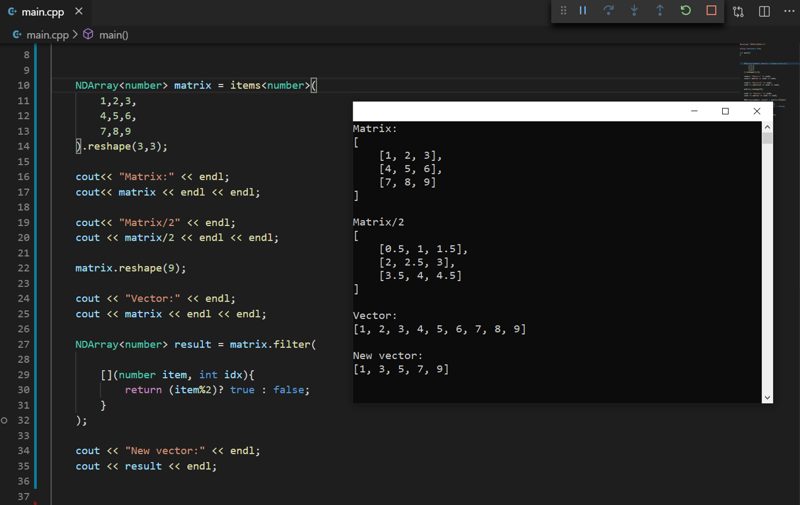

# DM4th
DM4th es una librería escrita en `C++` que prevee numerosos métodos y clases que permitirán un fácil manejo de operaciones con vectores, matrices, árboles y números complejos. 

## Características
- Clase tipo `NDArray` que permitirán manejar vectores y matrices multidimensionales de manera dinámica.
  - Métodos de push, pop, resize y reshape incluídos.
  - Sobrecarga de operadores aritméticos y binarios.
  - Sistema de conteo de referencias por array que permitirán administrar memoria sin pensar en punteros por parte del programador .
- Clase tipo `Tree` con métodos para manejo de estructuras no lineales de forma sencilla.
  - Árboles binarios y árboles N-arios soportados.
  - Métodos de push, pop y resize de hijos.
  - Sistema de conteo de referencias por cada hijo de un árbol que permitirán administrar memoria sin pensar en punteros por parte del programador.
- Métodos numéricos de utilidad para diferentes operaciones de cálculo diferencial e integral, álgebra lineal, entre otros.
  - Soluciones de métodos de búsqueda de raíces de función como Newthon-Raphson y el Método de Bairstow con soporte de raíces complejas.
  - Soporte de resultados con números reales y complejos en todos los métodos incluídos en la librería.
- Entrada y salida por consola utilizando métodos input() y print() de números complejos, arreglos multidimensionales y árboles.

## Instalación
Prerrequisitos:

1. Tener instalado un IDE de desarrollo para C++ o un editor de texto. ([Visual Studio Code](https://code.visualstudio.com/) recomendado).
    - Si estás en Visual Studio Code, instalar la [extensión de C++](https://marketplace.visualstudio.com/items?itemName=ms-vscode.cpptools) 
2. Tener instalado un compilador de C++ en tu PC (`Mingw-w64` recomendado para Windows)
   Si ya lo tienes instalado, saltar a Incluir DM4th en tu PC.
    -   Descarga el compilador desde el siguiente [enlace](http://mingw-w64.org/doku.php/download/mingw-builds). Es importante que la ruta de instalación no contenga espacios (en otras palabras evitar rutas como `C:/Program Files/`), se recomienda instalar el compilador en `C:/Mingw-w64`
  
        
    - Es necesario incluir en el `PATH` la ruta donde están los archivos binarios del compilador:
        - Incluir en el path la siguiente ruta: `c:\mingw-w64\x86_64-8.1.0-win32-seh-rt_v6-rev0\mingw64\bin"`, si has instalado el compilador en una ruta distinta, debes modificar la ruta correspondiente.

        
        
        - Reinicia tu PC. Puedes comprobar que el compilador está instalado ejecutando desde el Command prompt el siguiente comando: `g++ --version`

Incluyendo `DM4th` en tu PC

1. Clona DM4th en tu PC o descarga el `.zip` del proyecto
2. Abre la carpeta DM4th desde el Visual Studio Code
    - NOTA: Sólo para la primera vez que descargues o clones `DM4th` en un nuevo directorio, debes generar los archivos binarios. si utilizas Visual Studio Code, ejecuta la tarea `Make DM4th Binaries`; si usas otro editor, puedees generar los binarios desde make/makeDM4thProject.bat 
    
3. Abre el archivo `main.cpp`, ¡escribe el programa que desees y ejecútalo!

